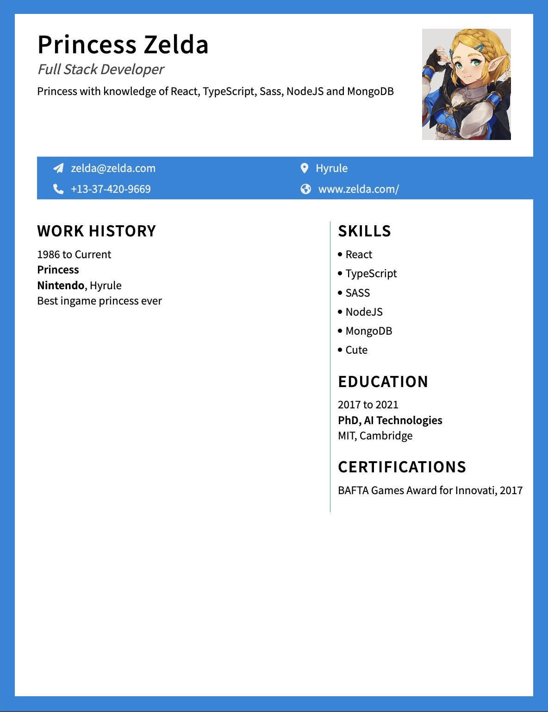

# cv-creator

<h3 align="center"><a href="https://praesidi.github.io/cv-creator/">DEMO</a></h2>

## About the project

My first React project! A simple CV Creator which I made as a part of The Odin Project curriculum. The main goal was to practice with states, props, and other fundamental React features.

## Features

- Real time preview

## Resources

- Favicon: [flaticon.com](https://flaticon.com)
- Icons: [fontawesome.com](https://fontawesome.com/)

## Built with

- TypeScript
- React
- CSS
- Vite
- nanoid()
